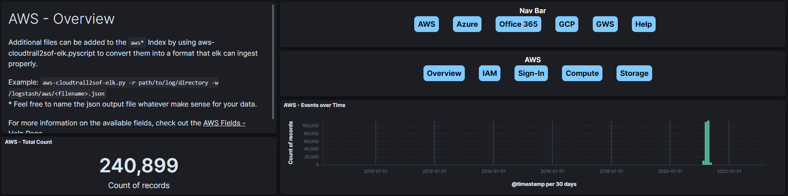
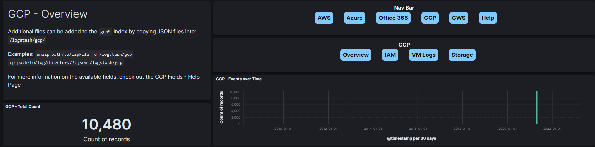
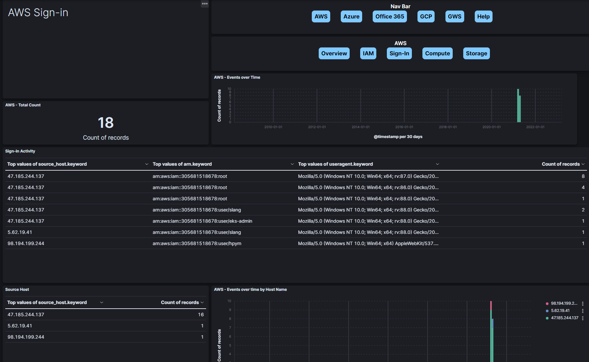
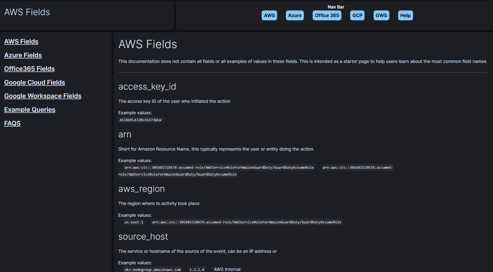

# Cloud Dashboards for SOF-ELK

This repository contains a collection of free visualizations and dashboards that are compatible with the SOF-ELK open-source project. These saved objects are designed to help security professionals analyze and pivot through cloud logs more efficiently. The project currently supports cloud log types from AWS, Azure, Google Cloud, Google Workspace, and Office 365.

All objects in this project are tagged with "CheckSomeBytes - Cloud" for easy management, allowing users to remove or update them at a later date.

## Navigation 
The dashboards are linked together with a navigation pane that runs along to the top of each of the dashboards.

*AWS Navbar* 

*GCP Navbar* 

In practice this makes for a fluid experience that allows the user to bounce around between cloud platforms as well as different views within each of the platforms

---
## Dashboards
Each of the dashboards filters data to a single view of the data and provides acitvity specific to that perspective. 

*AWS Sign-In Dashboards*  

There are 29 Dashboards across four major cloud providers that each have a unique view of the data. 

AWS - Overview  
AWS - Compute  
AWS - IAM  
AWS - Identity  
AWS - Sign-in  
AWS - Storage  
 
Azure - Overview  
Azure - Compute  
Azure - IAM  
Azure - Login  
Azure - Network  
Azure - Storage  

GCP - Overview  
GCP - Compute  
GCP - IAM  
GCP - Storage  
GCP - VM Logs  

GWS - Overview  
GWS - Admin  
GWS - Drive  
GWS - Email  
GWS - Login  

O365 - Overview  
O365 - AzureActiveDirectory  
O365 - Exchange  
O365 - Logins  
O365 - Sharepoint  

--- 

## Built-In Documentation 
Within the dashboards there are several pages to help users orient themselves with the log fields and to get started making queries.  

There are 8 todal "Help Dashboards". These do not provide any additional views of the data but instead act as documentation for the available fields.   
Cloud Help - Overview  
Cloud Help - AWS Fields   
Cloud Help - Azure Fields  
Cloud Help - Google Cloud Fields  
Cloud Help - Google Workspace Fields  
Cloud Help - Office 365 Fields  
Cloud Help - Example Queries  
Cloud Help - FAQS  

## Table of Contents

1. [Prerequisites](#prerequisites)
2. [Installation](#installation)
3. [Usage](#usage)
4. [Support and Contribution](#support-and-contribution)
5. [License](#license)

## Prerequisites

Before you begin, make sure you have:

- A working SOF-ELK instance
- Appropriate cloud logs ingested into your SOF-ELK instance
- Kibana access to your SOF-ELK instance

## Installation

To import the saved objects into your Kibana instance, follow these step-by-step instructions:

1. Download the CheckSomeBytes - Cloud saved objects `.ndjson` file from this repository.
2. Open your Kibana instance in a web browser.
3. Navigate to the Kibana main menu by clicking on the hamburger icon (three horizontal lines) in the upper left corner.
4. Click on "Stack Management" at the bottom of the main menu.
5. In the "Stack Management" menu, click on "Saved Objects."
6. In the "Saved Objects" page, click on the "Import" button, located in the upper right corner.
7. Click on the "Select a file" button in the "Import saved objects" window and select the downloaded `.ndjson` file.
8. Make sure the "Automatically overwrite all saved objects" checkbox is unchecked to avoid accidental overwrites.
9. Click on the "Import" button to complete the process.

The CheckSomeBytes - Cloud visualizations and dashboards should now be available in your Kibana instance.

## Usage

To access the CheckSomeBytes - Cloud visualizations and dashboards:

1. Navigate to the Kibana main menu by clicking on the hamburger icon (three horizontal lines) in the upper left corner.
2. Click on "Dashboard" in the main menu.
3. Use the search bar to search for "CheckSomeBytes - Cloud" and select the desired visualization or dashboard.

Feel free to customize these visualizations and dashboards to fit your specific needs and requirements.

## Support and Contribution

If you encounter any issues or would like to contribute to this project, please feel free to open an issue or submit a pull request. We welcome feedback and suggestions to improve the visualizations and dashboards.

## License

This project is free and open-source, distributed under the [MIT License](LICENSE). Feel free to use, modify, and share this project as needed.

